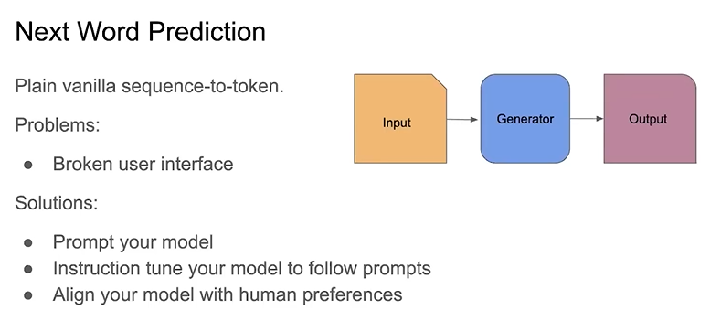
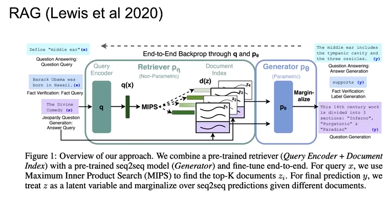
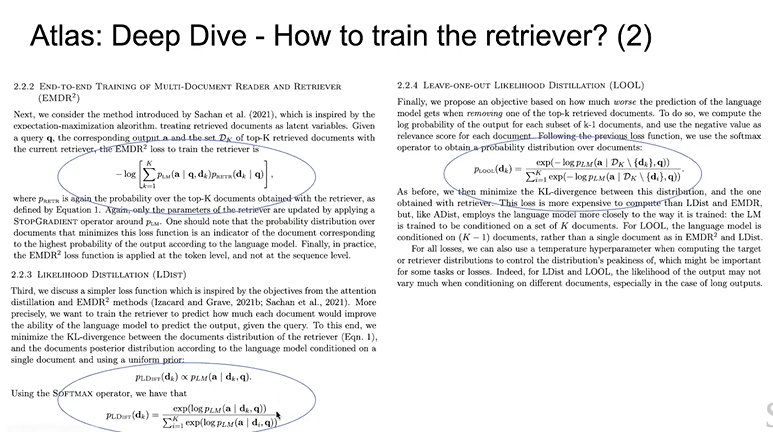
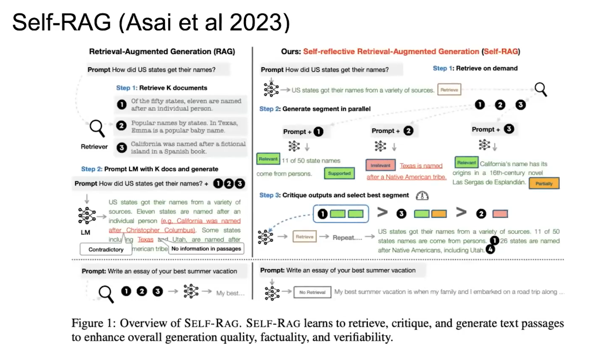
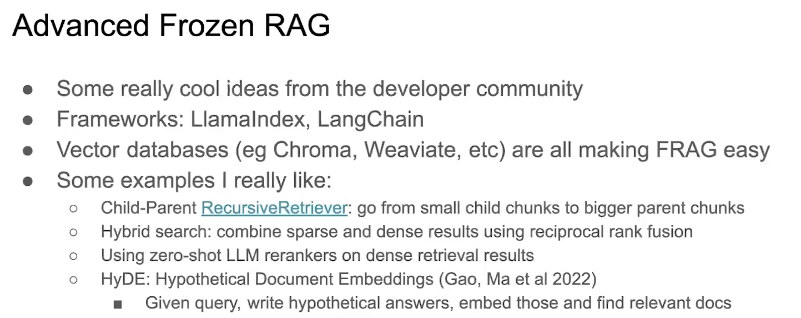

# 语言模型

我们仍然处于一个语言模型的时代。如图所示，语言模型的想法就是你取一个序列，然后将标记概率向量化。这个概念并不是由OpenAI发明的，而是早在几十年前就被提出了。我能找到的最古老的文献是1991年提出的第一个神经语言模型，2003年有一篇来自Bengio的论文，其中已经包含了词嵌入等内容。这些显然是语言模型（Language Model，LM），而不是大语言模型（Large Language Models，LLMs）。

事实证明，如果你使它们变得非常大，并用这些庞大的神经网络参数化，那么你就会得到一些非常强大的东西，真正显示出涌现的特性。这就是为什么我们对这些东西感到兴奋。如果我们从经典的计算机科学角度来考虑这个问题，它有输入和输出，中间是生成器。所以我们取一个序列，输入序列，然后模型的任务是预测下一个Token，这是一个非常简单的模型，这就是为什么在1991年很容易就提出了这个想法了，因为这个想法是非常直观的，但在很长一段时间里，这个想法的真正问题在于用户界面。我认为这就是很多人可能百分之百理解ChatGPT的原因，这就是Chatgpt真正解决的问题。

## 语言模型存在的问题
最初，你需要想出这些非常奇怪的提示，以便让你的语言模型做你想让它做的事情。因为我们更擅长告诉我们周围的人或事物我们想要什么。如果我们有一只狗，我们会说“坐下”，而不会以一种非常奇怪的方式提示它坐下。如果你想生成一些海盗或莎士比亚风格的说唱歌词，那么你可以告诉它生成一个海盗风格的说唱歌词。这种类型的指令数据实际上在网络中非常罕见，所以你需要做的是修复语言模型的用户界面，而实现这一目标的经典方法基本上就是ChatGPT使用的序列。所以你以一种特定的方式提示模型，无论你在那之上做什么（监督微调、对齐、RLHF），所以这是第一件事。现在你有一个可工作的语言模型和一个可工作的用户界面。那我们现在就完成了吗？显然没有。所以现在语言模型似乎正在席卷世界。但如果你和任何人交谈，尤其是在企业中，例如，他们有非常严格的准确性要求。他们会告诉你，他们还不能将其投入生产。

原因是因为有这些熟悉的问题。第一个是幻觉，这些模型经常会非常自信地编造一些东西，这在某种程度上更加令人不安。所以我们真的不知道为什么这些模型会说他们所说的话。
第二个是过时，这是一个很大的问题，就像ChatGPT不知道在某个截止日期之后发生了什么，他们每隔一段时间就会更新一次，但你希望有一个始终完全更新的系统，永远不会过时。你想要能够修订系统的信息，
如果你是一个欧洲组织，你需要担心GDPR，这意味着你需要能够从语言模型中删除信息，或者可能修改事实，但我们真的不知道该怎么做。所以，这对很多人来说是一个非常有趣的研究领域，即模型编辑。但这是我们真正希望能够解决的问题。
然后还有一个大问题，那就是如何定制这些模型。如果你是一家公司，或者如果你想在自己的数据上有一个语言模型，你有不同的数据，你如何让它在自己的数据上工作，所以现在大家都开始使用的一个解决方案是将其与外部存储器配对，这就是RAG（Retrieval Augmented Generation，检索增强生成）。

## 上下文化

所以我们可以说整个讲座基本上是关于RAG的，但要理解这里发生了什么。我们需要像以前一样生成，除了输入和提示之外，我们还提供了这个额外的上下文，我们使用检索到的东西将语言模型进行上下文化。检索器通常非常简单，它只是一个查询和一个文档编码器，然后你会得到一堆文档，你把它们作为模型的上下文。

## 两种范式

这是一个超级简单的架构。我认为从这两个独立范式的角度来考虑这个问题是有用的。如果你曾经参加过考试，我相信你有。在闭卷考试中，你需要记住所有的内容，所以你需要把所有的知识都塞进你的参数和神经元。或者你可以进行开卷考试，在考试时可以访问所有这些书中的信息。RAG也是一个非常类似的东西。你可以将其设置成开卷考试模式，让它访问外部信息，比如维基百科或其他一些信息，或者基本上整个互联网，然后让语言模型在不必将所有信息都记住的情况下完成其工作。另一个我认为有用的区别是把所有的东西都塞进你的参数，这就是参数方法。所以我们在RAG中所做的就是添加了这个非参数检索组件。所以如果你想给它一个名字，你可以称其为半参数化。

## RAG为什么能够解决问题？

那么，为什么RAG能够解决这些问题呢？答案基本上是，如果你有这个单独的索引，这个单独的检索器，你可以将其替换为新的索引，因此你可以真正地定制它。因此，你可以根据用户真正想要看到的内容定制你的语言模型系统。显然，你可以更新这个索引，所以它不会静止不动，如果一切都出错了，你可以重新修改它。你得到的另一件事是Grounding。这就是我最初对这种架构感兴趣的原因，因为我想了很多关于Grounding和多模态之类的东西。实际上，Grounding的一个很好的方法是找到一些其他的信息，你可以用它来Ground你的生成。所以你真的希望语言模型只说它在这另一段文字或者甚至是它单独检索到的多模态数据中有证据的事情。所以如果你这样做，那么你就会减少幻觉。因为你总是可以指向你的来源，它总是建立在你的来源上，而且你会得到归因，你不知道模型为什么会说它在说什么，因为它找到了这个东西。

# RAG架构
## RAG相关的问题

在这节课剩下的时间里，我们将讨论这个基本的架构。它看起来是一个非常简单的东西，但实际上你可以问很多很多关于系统应该是什么样子的问题，而且这甚至还不涵盖你一半可以问的问题。我们真正关心的是如何优化整个系统，我们有这些独立的组件：生成器、检索器、查询编码器，等等。一些问题例如：我们如何对查询进行编码呢？我们如何更新文档编码器呢？我们有很多问题要问。正如你将看到的，这些问题也有很多可能的答案。这就是我们将要讨论的内容。

## 训练和测试时间

我认为当我们讨论这些问题时，你思考训练时发生了什么以及测试时发生了什么是很有用的。在训练期间，我们更新哪一个语言模型？我们如何更新它们？我们如何训练整个系统？我们可能根本不训练它吗？我们从头开始预先训练它吗？我们用已经单独训练过的组件来初始化它吗？如果你想设计一个这样的系统，这些都是你需要回答的问题。

在测试期间，你有整个系统，实际上是以某种方式一起工作的多个模型，你也可以做不同的事情，在测试时内给它不同的索引或者操纵采样方式之类的。这是所有这些东西的起点。我想如果你现在问别人，像RAG是什么，他们会想到这些内容。

## Frozen RAG

这基本上是冻结的RAG。这里根本没有训练。回到这些训练和测试时间的问题，这里只有测试时间，训练时间是与我们没有控制的这种黑盒子模型分开进行的。这个文档嵌入模型是目前在一些开源排行榜上名列前茅的东西。你用它来得到一些向量，然后你用来创建向量数据库，然后向量数据库只是一个搜索，它把搜索的信息提供给语言模型。然后这个向量数据库只是进行搜索，将搜索的信息提供给语言模型，并且将其作为上下文传递。这只是因为上下文学习会起作用，我认为作为一个机器学习者，这感觉非常不优雅。所以，这节课讨论的是我们能不能做得比这个冻结的东西更好。

## 通过检索上下文化

让我们从左边开始，如果我们想用向量数据库来超越这个冻结的东西本身，那从检索的角度看会是什么样子呢？

### 稀疏检索

一切检索的起点都是TF-IDF，它是一种稀疏检索方法，你有一个评分函数来查看文档D和查询Q。然后基本上有两个术语，一个是TF（Term Frequency，术语频率），另一个是IDF（Inverse Document Frequency，逆文档频率），这种逆文档频率实际上是Karen:Spark-Jones提出的一个非常好的想法，她做了一些了不起的工作。IDF的基本思想是你想要看一下那些非常特殊的单词，这些单词不会出现在很多不同的文档中，所以单词之间的重叠实际上并不重要，就像到处都有一样。所以你想要有一些特殊的词。这就是 TF-IDF 的要点，它为文档查询重叠给出一个分数，然后你可以用各种方式来加权。所以有一些奇怪的不同参数，比如B之类的，可以让它比只有 TF-IDF 分数更好，你可以在那里做一些调整。

BM25代表的是最佳匹配 25，我试着去发现，25实际上是从哪里来的？那是因为之前的24个实验失败了，所以实际上是第 25 次看起来有效，这就是为什么它叫做BM25。稀疏检索只是计算单词，你有一个庞大的的向量，其中包含所有这些单词出现的次数。它是稀疏的，因为大多数单词从不出现，它就像是一个词汇大小维度的向量，大部分都显然是零，如果你想在 CPU 上进行快速搜索，这实际上是一种很好的性质，因为在CPU上，稀疏矩阵的乘积计算起来相当容易。这在名为DrQA的系统中使用，这实际上是这种开放域问题回答范式的第一个神经网络实例。如果你有一个问题，比如，华沙的居民有多少人？你基本上想问维基百科这个问题的答案是什么。然后你有了基于稀疏矩阵的文档检索器，所以在这种情况下，你把它传递给BM25检索方法，我认为这当时仍然是一个LSTM和一个文档阅读器模型，然后那个模型给你答案。所以我认为这实际上是第一个在检索和生成系统之间有这种分离的情况，用于回答基于开放领域知识的复杂问题。

### 密集检索

在稀疏矩阵之后，进行了大量关于密集检索的工作。密集检索的优势在于，这只是词嵌入，基本上是向量，它们现在是密集的，不再是稀疏的。所以在维度方面要小得多。密集检索的一个很好的优势是它不是关于特定的单词，如果有同义词，你仍然可以找到相关的文档，而这是在稀疏表示中做不到的。所以密集的优势是你可以获得语义相似性。你可以通过词嵌入来做到这一点。但这并不是那么有效，但在人们开始思考这个问题的时候，BERT已经存在了，并且BERT真的很擅长为整个词序列提供一个向量表示，一个句子表示或者一个段落表示。这些很酷的系统，比如ORCA和DPR，它们基本上使用检索作为系统中的一种潜变量，并且让这个潜变量能够工作、足够好的方式是在相关信息上对检索器进行预训练，所以对于ORCA，他们做了一些称为逆关闭的事情。而在DPR中，他们只是对其进行了监督训练。但实际上，核心思想在于，正如你在这张图中所看到的，如果你添加了大量文档并且计算分数函数的方式要简单得多，那么你可以比BM25做得更好。

## 向量数据库

点积的好处是可以在GPU上非常高效地执行它们。因此，你真正想要的是最大内积搜索（MIPS），你可以使用ANN （近似最近邻搜索）执行MIPS。因此，在那个时候，我一些同事进行了一项非常出色的工作，被称为FAISS（Facebook Artificial Intelligence Similarity Search，Facebook人工智能相似性检索），它真正成为了所有这些现代向量数据库的基础。所有流行的数据库，它们都是对这个FAISS思想的重新实现。一个是用Rust写的，一个是用Go写的，但基本上都是相同的思想-FAISS。因此，FAISS真正推动了许多这些东西。每当有人告诉你有关向量数据库的信息时，只需想一想FAISS，非常快的点积。
基本上，你有一堆向量，你可以计算完整的点积，这种方式有点低效，你可以尝试压缩向量的子空闻，然后只看一种类型的质心。所以你可以量化完整向量的子向量，然后只对质心进行更快的搜索。
## ColBERT

在孪生网络里，你有两个不同的BERT模型或者其它编码器，然后得到这两个向量，通过点积得到一个单一的分数，但是如果你愿意放弃这种编码器方法，你可以做各种各样更加花哨的事情。斯坦福的一个同事提出了一个真正好的例子是Colbert，这是一种晚期交互（Late Interaction），不仅仅是有这个点积，你有一种更复杂的计算分数的方式，其中你在不同词之间聚合了最大相似性分数。

## SOTA

如果我们看看现在最先进的发展方向，这些向量数据库的一个好处是它们非常高效，点积比这个晚期交互的东西更高效，特别是如果你进行近似最近邻搜索。但有一些很酷的工作，所以像SPLADE这样的东西，它们基本上在某种程度上将稀疏和密集相结合。
稀疏的一个大问题是你不能真正处理同义词之类的东西，但你可以做的是采用一个密集的模型，比如一个BERT模型，看一下你的序列中的这个词，尝试看看哪些其他词适合在同一个位置，所以这给了你同义词。现在你可以把所有这些同义词给一个稀疏向量，然后你可以做稀疏点积。
我有一个更有效的方法来做搜索，而不是放弃你从密集表示中得到的所有很酷的东西。

另一个我非常喜欢的想法叫做DRAGON，我认为它是最好的广义密集检索器。如果你现在想拿一些现成的东西，然后去Hugging Face之类的地方，那么Dragon或Dragon Plus可能是你想要用于密集检索的东西。他们训练的方式是通过这种渐进式数据增强策略，通过采样非常困难的负面样本，使模型变得越来越好，这给了你很好的表示。
关于这个的另一件事，我认为关于检索的一般情况，如果你看一下DRAGON周围的开发者社区，他们现在都在做混合搜索。实际上，你可以将来自稀疏、BM25或其他显示的东西的搜索结果与Dragon组合起来。然后你会得到更好的排名，你会得到两全其美的效果，但是随之而来的是如何将结果结合起来的所有这些问题。

# 上下文化生成器的检索器

我们能否将生成器的检索器置于上下文中呢？即使它是一个我们可能无法访问权重的生成器。它可能是一个GPT 4模型，我们只是将它发送到某个API，然后得到一些东西。

## Replug

我看过的一篇论文叫做Replug，只是为了解释一下这是什么样子的。你有这个上下文，一个用标准检索步骤进行的检索器，这是一个密集检索器，现在你计算可能性只需对前 K个文档的得分进行归一化，以得到一个分布，然后你会将每个检索文档分别提供给你的语言模型。这样你就可以查看该语言模型对正确答案的困感度。现在我们有了这两个概率分布或者说是两种可能性，我们可以最小化KL散度，以确保我们实际上可以检索到导致语言模型对正确答案困感度最低的文档。这是一个非常简单的想法，而且效果非常非常好。而且这个好处是完全不受上游发生了什么的影响，这对于任何语言模型的编码器解码器都适用。你所需要的是一个困惑度得分，但对于大多数语言模型，你都可以获得这个得分，不一定是全部都有。

## In-Context RALM

关于上下文检索、增强语言模型，还有另一篇论文，整篇论文基本上就是关于只做BM25，并且直接将内容提供给语言模型的上下文，它就能够工作。这有点像Frozen RAG，但在某种程度上更为原始，其中检索器是古老的稀疏算法，但它的效果非常好。他们有一个非常棒的章节，展示了你可以在BM25的结果之上添加这个重新排序器，你可以向这个重新排序器回传。你仍然完全固定语言模型，在参数数据上有一种停止梯度的情况，那只是你的语言模型，但现在你有了这种可以向其中回传的排名函数，这就是你的重新排序器。它可以是一个BERT模型或者任何其他在最初从BM25检索到的内容之上运作的东西。
我们正在逐步朝着一个更加优化的系统发展，这个系统能够以一种更加有效和上下文化的方式进行检索增强。

## 通过检索-重排序进行上下文化

为了指出这个重新排名是什么样子的，我们增加一个额外的步骤。现在我们有检索器，重新排序器，生成器和输出。

# 上下文化整个架构

接下来我们可以做的事情是优化检索器和生成器，这开始进入整个架构的适当上下文化，我们希望一切协同工作。与其拥有这个冻结的东西，其中一切基本上都不知道其他部分存在。就像大脑的两个半球，它们彼此不交流。一个是检索器，一个是语言模型，他们之间没有连接，就像是把东西扔过篱笆，你希望一切顺利。与其如此，不如我们让一切更加紧密，一起学习。

## RAG

通过生成器实现这一点的第一种方式是RAG（Retrieval Augmented Generation，检索增强生成），我们在2020年在FAIR完成了这项工作。它与我们已经看到的非常相似。我们有一个检索器，它可以处理不同的文档。你得到一些得分函数，提供给生成器生成答案。现在，你想要一路回传并更新生成器。因此，在我们之前看到的两种架构中，你保持生成器固定，将回传应用于检索器，但在这里，我们更新一切。不是完全一切如你所见的那样，但我们还将更新检索器和生成器的部分。在这个RAG模型中，我们实际上有两种不同的方法来做到这一点。

当我们谈论这个时，如果你思考足够长时间，你会想到何时需要检索。例如：就像，每次生成一个新的标记时我要检索吗？还是我只检索一次然后生成整个序列，或者也许我想要在每个结束标记时检索。实际上有两种不同的方法来做到这一点。

在这篇论文中我们所做的基本上是，整篇论文的重点是这个冻结的东西实际上并不太有效。所以我认为现在人们称之为RAG的东西通常指的是冻结的东西，但如果我们只是做了冻结的东西，整篇论文基本上是不会被任何地方接受的。整篇论文的重点是你想要对其进行优化。所以在我们公司中，我们把这个冻结的东西称为“科学怪人”，因为实际上就像你把这些不同的部分拼凑在一起一样，但它实际上并不需要解决问题。所以我想对这里的每个人来说都是个好消息，因为现在有很多机会可以做得比大多数人现在使用的要好。

## FiD

原始RAG架构的局限性之一是它只支持非常小的K。但如果你有很多很多的文档，那么问题是你需要把它们都放在上下文中。但你如何才能真正做到这一点呢？你可以做的一件事是首先编码这些内容，这样你就可以得到一个单一的表示或者只有少数几个顶层的表示，然后你把它们连接起来，然后把它们喂给解码器。这就是FID融合和解码器。正如你所看到的，这可以扩展到更多的段落，这会导致你所关心的分数相应提高。这是一个非常酷的想法，所以我们慢慢地转向了更多的仅解码器架构。在RAG中，我们有这个BARC模型，它是一种编码器-解码器架构。但在这里，你只有这个解码器，在先前检索的内容上进行一些花哨的注意力操作。

## KNN-LM

还有另一种纯解码器语言模型架构是 KNN-LM，我觉得它在简洁性方面非常优雅。所以基本上你只有一个普通的语言模型，但你插入了正常的语言模型权重，我们用你检索到的东西，所以基本上你有某种提示，你在大语料库会发现类似的东西，你看看类似的东西后面的单词，你对那个东西重新排名，你采样前 K 个，然后重新规一化。现在你有一堆分数，你可以在检索到的非参数化内存分数和参数化语言模型分数之间进行插值。所以从某种意义上说，这是非常晚期的融合。实际上在最后，你把两者结合起来。它允许你重新关联到纯语言模型的概率或概率分布。这个方法非常有效，尤其是在你有一个庞大的检索语料库的情况下。如果你有数以万亿计的标记在其中，你可以拥有一个规模较小的语言模型，它不需要进行太多的重型计算，因为你可以真正依赖于你正在使用的这个大型源语料库。

## Retro

这个想法被DeepMind的一篇名为Retro的论文所利用，他们展示了你可以从头开始训练一个比原来大25倍的检索增强语言模型。所以真的是完全从头开始预训练，而在相同的数据上在困感度方面超过这个25倍更大的语言模型，这相当令人印象深刻。这种架构比参数模型更高效，因为你可以依赖这个外部存储器。如果你的外部存储器足够大，你可以获得相当大的收益。所以Retro 在宣布时非常令人兴奋，但它是一篇DeepMind的论文，所以真的没有开源，没有方法验证它是否真的有效。

## Retro++

最近，NVIDIA推出了一项名为Retro++的工作，其中他们将Retro架构与基本上是RAG的东西混合在一起，他们在语言模型的上下文中将排名靠前的一个或前K个结果放在了这个混合体中。这是RAG和Retro之间的一种融合，他们展示了一些非常好的结果，但我认为这在某种程度上指出了这个大缺陷。这就是为什么我们需要在Retro的基础上使用上下文RAG来使其工作的原因。

总的来说，我认为在从零头开始预训练这些系统方面仍然有很多工作要做。Retro提供了一种可能性，但我们并不确切知道如何以正确的方式去做，这也是一个有趣的未解问题。

# 全面上下文化

在Retro和RAG中，我们实际上只更新了查询编码器。因为更新文档编码器是非常昂贵的，所以实际上，非冻结的密集检索增强为法的原始论文之一是这篇称为 REALM 的论文。

## REALM

这真的是一项有远见的工作，这基本上是第一种完全实现了更新所有内容的版本，其中包括文档编码器。有人能给我解释一下为什么更新文档编码器是昂贵的吗？假设我们的语料库中有一万亿个标记，我们进行前向传递，在最后得到一个梯度，通过检索器向后传播梯度，我们更新查询编码器，现在我们需要更新文档编码器，那么，在我们更新了文档编码器之后，我们需要做什么？我们需要重新编码整个网络。基本上每一个梯度更新，我们都需要重新编码索引。如果有数万亿个标记，那么就像在每次批量更新后重新编码网络一样，这样并不高效。

有很多种方法来更新文档编码器，REALM是为了T批次而这样做的，然后他们停下来，重新对整个网络编码，然后再次训练。这有点是异步更新。他们有这种非常花哨的分片机制，他们会将整个索引的某些部分摘下来，然后在运行时更新它们。你可以做到，只是非常昂贵。所以很多人一直在思考的一件事情，不完全是LoRa的想法，但类似的版本存在，就是你能不能使它更有效率，这样你就不必异步地进行这个操作了。所以REALM架构的一个缺点是它真的只是一个BERT模型，然后你用其他BERT模型对一个BERT模型进行检索增强，这不是真正的生成。它并不是真正的现代范式中的生成式AI，但如果你想读一篇关于这个主题的论文，那么这是一篇非常好的论文。

## Atlas

另一篇真的非常值得一读的是这篇名为 Atlas 的论文，它由 FAIR 团队的一部分很出色的人共同完成，他们做了像 RAG 和 FID 这样的工作。这是对这个架构中发生的一切的全面分析。他们首先看的问题是，我们如何训练这个检索器？我们已经看到了这方面的一些版本，但哪一个实际上效果更好？它们还没有在最佳设置中进行比较。所以一件事是，我们有这种FID风格的注意力蒸馏。所以这真的太复杂了，不能在这里详细说明。

但其他的实际上很简单。其中一个是我们以前在上下文RAG中见过的损失，我们在语言模型上有一个停止梯度，然后我们更新检索器。
另一个是我们在Replug看到的损失，我们有文档的KL散度，以及当你提供该文档时看到的改进。他们的另一件事基本上是相反的。如果我把这份文档拿出来，那会如何影响我对语言模型的困惑度？我认为这个非常优雅，因为这个确实涉及到，这个单一文档对于我正确回答这个问题有多有价值？

他们比较了所有这些不同版本，你可以看到Replug损失和这种留一损失，它们表现得比所有其他方法都要好得多。所以这是固定的检索器或者没有联合预训练，这些实际上是一种基线的被冻结的RAG模型或者封闭书籍。而且你可以看到，如果你优化了这些东西，你可以做得更好。

那么另一个问题是，你究竟怎么样来训练整个系统呢？就是说你在什么数据或者什么任务上训练这个？所以他们也尝试了一堆不同的版本。一个是做前缀LM，从互联网的某个地方获取一小段，然后他们预测从那一小段中的下一个片段，这很像句子到句子。也许以前是跳跃思想，但现在你有了这个检索步骤，你可以预测下一个句子。然后他们做T5风格的去噪，所以有大量的语言建模。然后他们有这个标题的部分生成部分。所以我认为从这张表中得到的启发是，无论你在这里做什么，他们都在使用 T5 模型。所以你在这里做的任何事情都需要符合语言模型的期望。

接下来，他们研究的最后一个问题是我们如何准确地更新这个检索器？我们需要更新文档编码器吗？或者我们可能需要做一些重新排序。或者我们可能只是更新查询？
令人惊讶的是，我认为他们发现只是更新查询。所以就像在原来的RAG论文中，实际上在很多情况下已经足够好了。所以这很好，因为它更有效率。如果你不需要一直更新你的文档。我认为这里真正的问题是，你的文档表示有多好，所以你需要有一个非常高质量的嵌入模型才能工作。如果你没有那个，那么这将不会起作用。但如果你有那个，那么你会得到一个非常好的查询微调的东西。所以ATLAS论文是关于尝试做一些少样本的语言建模任务，有一些例子是在上下文中给出的。

这里的主要收获是，如果你比较闭卷等价模型和检索增强模型，你会看到非常大的改进。这真的是整个部分的唯一要点。但我认为这确实说明了一些我们应该思考的东西。

## FLARE

让我们谈谈其他有趣的问题。其中一个问题是我们之前提到的检索时间。
如果我们想要检索每一个标记，那也是非常低效的，因为我可能不需要通过检索来生成。但是如果我在序列开始时只检索一次，那也可能不太好。所以我们理想情况下想要做的是有时我想检索，有时我不想检索，并且我将学会何时要在检索上花费计算预算。一篇很好的论文尝试了这个问题，名为FLARE。他们让语言模型决定何时应该进行搜索以及搜索什么。我认为这符合你在领域中可以看到的关于智能体的一般趋势。

## TRIME

我们已经在这里提到了另一个问题，那就是我们如何以规模进行训练？我们可以进行这些异步更新，我们可以重新排序，我们可以只在查询侧进行。有一篇非常好的论文，首先使用BM25创建一个批次，基本上在这个批次中，所有检索到的内容都非常相似。现在你有了这种批内更新，这有点像一个重新排序器，在这个重新排序器中，你对批次中的信息进行编码。使用另一个模型，现在你可以实时更新这个模型，所以你不必太担心做完整的文档侧更新。而且，在这里，真正重要的是你的索引有多大？如果你有一个很棒的索引，你基本上可以通过查找来解决任何问题。所以，与其把它塞进你的参数中，不如找到它。

## SILO

有一篇很好的论文叫做SILO。我认为在朱来一两年内，关于语言模型的一个有趣的事情是，你已经看到了，OpenAI和其他地方都有一堆针对数据的诉讼，究竟数据来自哪里。所以我认为一个非常优雅的解决方案是，你可以在你知道是安全的数据上训练一个RAG系统。你可以在Wikipedia上训练这个东西，但是在测试时你可以给它一个数据存储，里面可能有一些稍微有风险的信息。所以这个互联网上所有东西的大量索引，包括一些可能更高风险的东西，你仍然可以把它们放在你的索引中，但是你的语言模型，你的检索增强语言模型，我应该说，你知道那个东西是安全的，因为它是在公共领域的数据上训练的。这就是他们在Silo中所做的，他们表明这个方法非常有效。这是对语言模型部署周围的合规性和法律风险的一个可能的解决方案。

## Lost in the Middle

Stanford也有一篇很棒的论文，关于联系在中间丢失的问题。我认为这也是一种很有趣的现象，这是在Frozen RAG系统上进行的，但语言模型在关注的事物上与人类非常相似。因此，如果你向它们提供了一堆你要检索的内容，那么它们会关注你列出的第一件事和最后一件事，而忽略中间的内容。因此，如果它真的遵循秩函数，那么这条曲线就会一直向下但它又有点向上。因此，我认为这是一个非常有趣的观察结果，它显示了这些系统的脆弱性。所以，如果你有一个Frozen RAG系统，它可能会非常非常脆弱，就像检索上下文的顺序对你是否得到正确答案非常重要。

## Toolformer

所以有一些来自OpenAl的非常好的工作，他们展示了与先前的活跃检索相似的东西，这与只能读取些网络搜索的索引无关。显然，在这种情况下，你并不一定能够访问网络搜索。所以Bing或者无论他们在这里使用什么都不会更新其参数。但我只是想让你想一想，这是你可以做的另一件事。如果我们将这个问题真正推广到一般形式，那么你可以将语言模型视为工具使用者。因此，与其仅仅是检索增强语言模型，我们可以使用工具增强语言模型，而检索只是语言模型可以访问的许多工具之一，我们可以在这些工具的输出之上添加重新排序器和其他东西。所以，我认为一个重要的问题是，你到底如何让系统学习东西呢？因此，如果我们希望系统真学会如何亚确地采取这些行动，我们就需要强化学习。

## Self-RAG

在这种自我评估架构中，他们对这种检索步聚进行了极端处理，然后对其进行了批评，然后基本上只用一个语言模型就进行了一些自然语言推理及所有这些来回答问题。

## Instruction Tuning

指令微调对于使事情正常运行非常重要，因此修复用户界面，但指令调整几乎总是只发生在语言模型上，而不是整个系统上。所以我认为人们现在关注的一个有趣的事情是，使用类似Radit和InstructRetro的工具，我们如何fine-tune整个检索增强系统。一直到检索步骤，我们是否可以生成数据，以便它也正确地遵循指示，而目前在任何这些模型架构中都没有发生。

## 高级RAG

最后，我再谈一下人们所谓的高级RAG。开发者社区真的做了一些很棒的工作，像Llamalndex和LangChain这样的框架，以及像Chroma和Weaviate这样的开源向量数据库，它们都致为于让RAG变得非常容易，但这都是冻结的RAG。但即使是在冻结的RAG中，你也可以做一些令人难以置信的事情。我们已经提到了其中一些，比如childhparent递归检索器你找到小部分，然后将周围的大部分提供给语言模型，你可以进行混合搜索，其中我们使用相互排名融合。所以在将最终结果传递给语言模型之前，我们有不同的搜索结果，我们没有在得到最终结果之前将它们合并。还有zero shot，像一个大型语言模型重新排序器。所以基本上分数函数并不是来自于检索，而是直接来自语言模型。然后是假设性文件嵌入，我认为这是一个非常棒的想法，基本上是通过幻觉来修复幻觉，你提出一个问题，然后让语言模型产生一堆可能的答案。然后你去搜索可能答案的最近邻居，并将它们作为上下文，然后它根据此给出正确答案，这实际上就像是在产生答案的幻觉。我认为这是一个很好的解决方案。所以在冻结的RAG社区中也发生了很多事情，我认为这是非常值得关注的。

# 研究展望

未来仍然有许多非常有趣的开放性问题，所以如果你是一名学生，正在考虑如何解决这些问题中的任何一个，我认为你可以产生相当大的影响。我们究竟如何进行这种架构的预训练，我们甚至需要进行预训练吗？我认为甚至反向证明了你不一定需要预训练。也许我们做这件事的方式有些问题。
我认为这里有一个非常有趣的问题，如果我有一个巨大的索引和一个非常丰富的编码器，能够包含索引中所有信息，也许我可以移动，所以基本上将所有的记忆解耦到这个索引中。所以我有一个语言模型它什么都不知道，它只会说英语，它只是在上面推理，但它没有知识，因为那总是来自这个检索器。如果你能做到这样，那么你就会得到非常有趣的扩展拆衷。你可以拥有一个微小的语言模型，并使用检索来完成大部分繁重的工作，这很好因为那是一个缓存的计算。你已经有了嵌入，你只需要做点积。这比在语言模型中进行自注意力要高效得多。
我们可以超越编码器吗？我喜欢建立向量数据库的人，但我不确定我们会保留向量数据库多久，因为我认为重新排序器可能效果一样好，而且BM25比向量数据库更有效。所以我真的不明白为什么我们需要专门的向量数据库。所以我们正在看到的，但也许这是对硅谷投资策略等的一种批评。但是很多这些向量数据库公司现在基本上都成为了数据库公司。所以他们正在添加所有这些稀疏的东西，因为密集的东西还不够。事实证明，已经有很多相当不错的稀疏数据库存在，比如Postgres之类的，他们也都在向他们的数据库中添加向量，所以我认为这一切都将融合到数据库中。
我认为有一些有趣的东西可以看一下，以了解数据的性质。通过这个指示问题，我们是否可以为系统生成更好的合成训练数据？如何衡量检索是否正确？有一些框架试图取检索准确度和语言模型准确度的调和平均值。但我认为那些也很糟糕，因为我们实际上没有很好的数据集来衡量它。

## 多模态RAG

我个人总是对另一个问题充满兴奋，那就是多模态性。为什么我们要局限在只有文本的RAG系统呢？你可以用图像做同样的事情。你可以用视觉来增强语言模型，所以我们在Lens上做了这项工作，我们有一个被增强的语言模型，能够看到你可以简单地给一个计算机视觉管道，就像一个检索管道一样，然后将其传递给一个冻结的语言模型并传递上下文，这是是一个令人惊叹的视觉问答系统。它接近于DeepMind的flamingo的最新水平，这也很难复制，因为没有开源版本。所以我们在2021年已经开始了一些关于这个的初步工作，在那里我们有这个跨模态检索，还有FAIR最遍的一些工作，他们也在研究这个。如果你看一下这个领域的趋势，多模态性与GPT-4V之类的东西确实是一个热门话题，所以一切都在朝着那个方向发展。

## RAG2.0

总的来说，我认为如果每个人都能从 RAG 1.0，这个冻结的科学怪人RAG转向更加优化的版本，RAG2.0，那将是很好的。这确实是关于系统而不是模型，当你是一个检索器时，不仅仅是你的语言模型，而且它们是有些分开的。这是关于从系统的角度思考整个事情和你正在尝试解决的问题。所以我认为在深度学习中，事情总是在进步，如果你端对端地优化系统，那总是会获胜的。就像在计算机视觉或自然语言处理的早期，我们有像解析器和场景解析器这样的东西，而现在所有这些都已经不复存在，因为我们端对端地优化了系统。所以这里也会发生同样的事情。如果我们把它推向极致，就像你的文档中有一个分块器一样，把它分割成片段，你也可以应用到其中。为什么不呢？真的有人应该这样做。我认为权衡成本和质量以及零样本领域泛化，这确实是这些内容的重点所在。语言模型现在非常了不起，但很多时候它们的成本太高，无法部署在公司可以从中赚钱的地方。所以你想要做的是使其比现在更有效，并找到正确的成本质量权衡。我能想到的最简单的方法就是通过检索增强来实现。
<!-- # 论文汇总
Title，Paper，Code -->